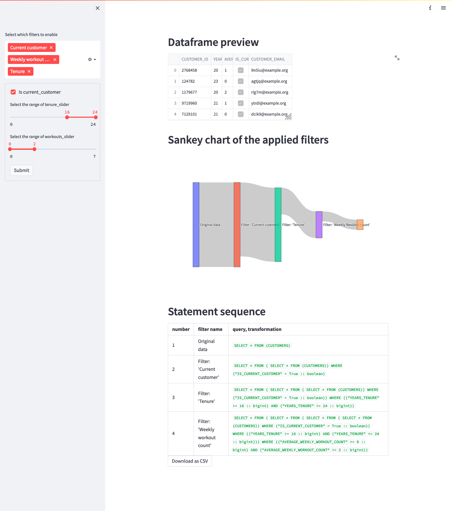

# What

This is a Streamlit demo that showcases how filters can be generated

The app connects to Snowflake and retrieves the data using snowpark Python, pushing the computations into a Snowflake warehouse.



## App features

* Dynamically selectable list of filters ("Select which filters to enable")
* Result preview
* Sankey chart showing the effects of selected filters
* Statement sequence showing which SQL statements are performed to get the result
* Download button to get the csv file with results

# Setup

To run the app, following steps are required:

1. [Setup data in Snowflake requirement](#data-setup-in-snowflake)
2. [Setup Python environment](#python-environment-setup)
3. [Add streamlit secrets to connect to Snowflake](#streamlit-secrets)
4. [Run streamlit app](#running-the-app)

## Data setup in Snowflake

The project comes with a [sql sheet](./.assets/setup.sql) to be run in the environment. Feel free to modify it to suit your environment.

## Python environment setup

Snowpark requires python 3.8.*, please ensure that you have that version available in your environment.

### Poetry

The project is using [poetry](https://python-poetry.org/) to manage the dependencies and local CI.

To setup the project:

1. [Install poetry](https://python-poetry.org/docs/#installation)
2. Open the project directory in a terminal emulator
3. (optional) to force the use of python 3.8, run `poetry env use /path/to/python3.8`
4. Run `poetry install` to install dependencies into project-specific virtual environment

### pip

1. Create a python 3.8 virtual environment
2. Switch into the created virtual environment
3. Use provided `requirements.txt` to install the dependencies: `pip -r requirements.txt` 

## Streamlit secrets

To be able to connect to an external source when developing locally
Streamlit provides a mechanism for storing secrets in the project
([doc link](https://docs.streamlit.io/streamlit-cloud/get-started/deploy-an-app/connect-to-data-sources/secrets-management#develop-locally-with-secrets))

In this case `secrets.toml` could look something like this:

```toml
[snowpark]
user = "<USERNAME>"
password = "<PASSWORD>"
account = "<ACCOUNT_LOCATOR>"
warehouse = "<WAREHOUSE_TO_USE>"
database = "<DATABASE FROM setup.sql>"
schema = "<SCHEMA FROM setup.sql>"
role = "<ROLE>"
```

## Running the app

After performing the setup and switching to the virtual environment, you can run the application using

`streamlit run main.py`
